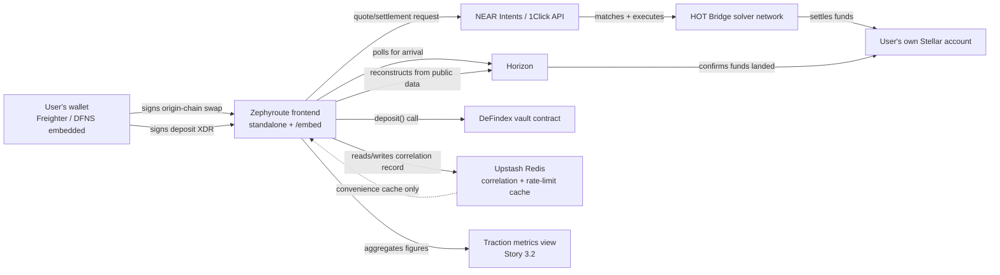

---
inputDocuments:
  - docs/prds/prd-stellar-intents-gateway-2026-08-25/prd.md
  - docs/prds/prd-stellar-intents-gateway-2026-08-25/addendum.md
  - docs/architecture.md
  - docs/epics.md
project_name: 'zephyroute'
user_name: 'JafetCHVDev'
date: '2026-09-13'
lastRevised: '2026-09-20'
purpose: 'Resolves PRD Open Question 10, the STRIDE threat model and monitoring plan the SCF Build panel requires as a tranche #2 condition.'
---

# Zephyroute Threat Model and Monitoring Plan

This document resolves PRD Open Question 10. It is built from the failure-mode evidence already gathered in `addendum.md` §B and §C, applied systematically against the actual system described in `architecture.md`, rather than a generic checklist. Every threat below is tied to a specific component already named in the architecture, not a hypothetical one.

**Format note (added 2026-09-20):** this document was restructured to follow the SDF-published STRIDE Threat Model Template (`developers.stellar.org/docs/build/security-docs/threat-modeling/STRIDE-template`) and On-Chain Monitoring Plan Template for Builders, checked live rather than assumed, after the SCF Official Rules pages were read in full and found to reference these specific templates for the tranche #2 requirement. The original 2026-09-13 version covered the same substance but in a shape this project invented independently; no analytical content changed in this restructuring, only its organization, numbering, and the addition of a dataflow diagram and closing checklists the official templates require.

## 1. What are we working on?

**What this system protects:**
- The user's ability to sign transactions correctly, meaning what they see matches what they sign (AC #4).
- The integrity of quote and deposit data between the user and 1Click/DeFindex/Horizon.
- The privacy of the correlation record (which addresses used the gateway, and when).
- The integrity of the traction data Zephyroute reports to the SCF panel.
- Availability of the core flow (quote, sign, settle, deposit).

**What this system explicitly does not protect, by design:** user private keys. They never enter any Zephyroute-controlled system at any point (AC #1), so key theft is out of scope for this threat model, not because it is unimportant, but because the architecture already eliminates it structurally rather than defending it.

**Dataflow diagram:**

## 2. What can go wrong?

STRIDE analysis. Every category has at least one identified issue, each with a unique ID (`<Category>.<n>`).

### Spoofing

| ID | Attack scenario |
|---|---|
| Spoof.1 | An attacker signs a fake nonce claiming to be another user's address, to read that address's correlation status. |
| Spoof.2 | A malicious third-party site frames `/embed` to impersonate a legitimate partner and phish users inside a fake partner-branded shell. |
| Spoof.3 | A compromised DNS or MITM returns fake data pretending to be 1Click, DeFindex, or Horizon. |

### Tampering

| ID | Attack scenario |
|---|---|
| Tamper.1 | A malicious script (XSS) alters what is rendered on screen before signing, even though the underlying XDR object is correctly validated and typed. |
| Tamper.2 | An attacker with access to the Redis correlation record alters a settlement or deposit status to mislead a user. |
| Tamper.3 | A tampered deposit XDR is submitted for signature. |

### Repudiation

| ID | Attack scenario |
|---|---|
| Repud.1 | A user claims they never signed a transaction they actually signed. |
| Repud.2 | A dispute arises over what traction figures Zephyroute reported to the SCF panel. |

### Information Disclosure

| ID | Attack scenario |
|---|---|
| Info.1 | Enumeration of user addresses and activity through the correlation API. |
| Info.2 | 1Click or DeFindex API keys leak into the repository or logs. |
| Info.3 | A client-visible error message or log accidentally includes a full request payload, a raw XDR, or a wallet address in a way that leaks more than necessary. |

### Denial of Service

| ID | Attack scenario |
|---|---|
| DoS.1 | Abuse of the correlation-layer API routes. |
| DoS.2 | Abuse of quote requests to run up API costs. |
| DoS.3 | 1Click, DeFindex, or Horizon become unavailable. |

### Elevation of Privilege

| ID | Attack scenario |
|---|---|
| Elev.1 | An anonymous visitor accesses the project-team-facing traction metrics view (Story 3.2, FR11). |

## 3. What are we going to do about it?

Remediation entries, each tied to the issue ID it addresses (`<IssueID>.R.<n>`).

| ID | Mitigation / remediation | Residual risk |
|---|---|---|
| Spoof.1.R.1 | The signed-nonce protocol (Authentication & Security, Story 1.12) verifies the signature recovers to the claimed address before returning data. | None significant. This closes the enumeration gap found during Architecture validation. |
| Spoof.2.R.1 | CSP `frame-ancestors` configuration (Story 4.2). | **New requirement:** the `frame-ancestors` directive must explicitly allowlist confirmed partner origins by name (for example `https://<confirmed-partner-domain>`, whichever partner is actually pursued), never a wildcard or `*`. A generic "permit framing" policy would let any site frame the widget and dress it up as something else. |
| Spoof.3.R.1 | Standard TLS/HTTPS on all three integrations; `lib/validation.ts` checks response fields against what was requested (AC #3). | Residual, inherited risk: Zephyroute cannot independently verify the authenticity of 1Click's, DeFindex's, or Horizon's own infrastructure. Accepted as an inherited trust boundary, consistent with the project depending on these as production APIs with no SLA of their own. |
| Tamper.1.R.1 | `ValidatedTransactionXDR` guarantees the underlying data is correct, but does not by itself prevent a compromised page from rendering something different from that data. | **New requirement:** an explicit `script-src` CSP directive (not just the `frame-ancestors` one already scoped for the embed) restricting script execution to Zephyroute's own bundled code, no inline scripts, no third-party script origins beyond what is strictly needed. This closes a gap the existing CSP discussion never covered, since it only addressed framing, not script injection. |
| Tamper.2.R.1 | The correlation record is explicitly a convenience cache, never the source of truth (Rule #9, AC #9); a tampered record would be caught the moment the app falls back to querying Horizon/DeFindex directly. | Low residual risk, well-mitigated by the existing architecture, not something to add new controls for. |
| Tamper.3.R.1 | `ValidatedTransactionXDR` (Story 1.9) and the on-screen destination/amount review (Story 1.10) together enforce AC #4. | None significant beyond the script-src hardening above (Tamper.1.R.1). |
| Repud.1.R.1 | The transaction hash and Horizon explorer link shown starting at the `submitted` state (Story 1.11) is an independently verifiable, cryptographically signed record. | None. Soroban signatures are themselves non-repudiable. |
| Repud.2.R.1 | AC #9 already guarantees every figure is independently reconstructable from public data. | None. This is already a structural strength of the architecture, not something this threat model needed to add. |
| Info.1.R.1 | Signed-nonce read authorization (Story 1.12). | None significant, already closed. |
| Info.2.R.1 | Environment variables only, `.env.local` git-ignored (AC #2). | **New requirement:** the CI pipeline (`.github/workflows/ci.yml`, Story 1.3) adds an explicit secret-scanning step (for example, a GitHub-native secret scanning check or an equivalent tool), as a merge-blocking gate. "Never commit a secret" is a policy; a scanning gate is the actual enforcement, consistent with this project's existing enforcement-not-convention pattern. |
| Info.3.R.1 | Not yet addressed anywhere in the existing documents prior to this threat model. | **New requirement:** the error envelope (`{ error: { code, message } }`, Implementation Patterns) must never include raw request payloads, full XDRs, or stack traces in what reaches the client; detailed diagnostic information stays server-side in the monitoring tool (see Monitoring Plan below), never in the response body itself. |
| DoS.1.R.1 | `@upstash/ratelimit`, sharing the same Redis instance (Authentication & Security). | **Residual risk to monitor, not solve architecturally:** if Upstash Redis itself is unavailable, the app correctly stays available by falling back to direct Horizon/DeFindex queries (AC #9), but the rate limiter is unavailable during that same window, since it depends on the same Redis instance. This is an accepted, honest tradeoff (availability over rate-limiting during a Redis outage), not a flaw to fix now, but it must be an explicit monitored condition (see Monitoring Plan). |
| DoS.2.R.1 | Quote requests go directly from the client to 1Click (Architectural Boundaries), not proxied through a Zephyroute-owned endpoint. | This is a deliberate architectural boundary: abuse protection for quote requests is delegated to 1Click's own infrastructure, not duplicated by Zephyroute. Documented here explicitly rather than left as a silent assumption. |
| DoS.3.R.1 | Upstream availability transparency NFR, the interim monitoring commitment (Infrastructure & Deployment). | Already covered; the Monitoring Plan below makes this concrete. |
| Elev.1.R.1 | **None prior to this threat model.** Story 3.2 described the view as "project-team-facing" but never specified how team identity is verified, a genuine gap found while writing this threat model. | **New requirement:** Story 3.2 gains an access-control mechanism appropriate to this project's minimal-infrastructure philosophy (Rule #9), not a full admin auth system. The lightest sufficient option is Vercel's own deployment protection (password or team-member-only access) on that specific route, avoiding new proprietary authentication code. |

## 4. Did we do a good job? (STRIDE)

- [x] At least one issue identified for each of S, T, R, I, D, and E (3, 3, 2, 3, 3, 1 respectively).
- [x] At least one visual dataflow diagram included, showing process flow between every named entity in the system (Section 1).
- [x] Every issue has a unique ID and at least one remediation entry with a corresponding ID.
- [x] Every threat is tied to a specific, named component in `architecture.md`, not a generic or hypothetical one.
- [x] Five new requirements found while writing this document are reflected as concrete story or architecture amendments, not left as free-floating findings (see Resolution section below).
- [ ] Independent third-party review of this threat model. Not yet done; this is founder/AI-drafted, consistent with the project's "documentation before code" phase. Worth a second set of eyes (a security-minded community member, or the SCF panel's own review) before treating it as final.

## Monitoring Plan

Extends the interim monitoring commitment already made in Architecture (Infrastructure & Deployment) into a concrete plan, following the SDF On-Chain Monitoring Plan Template for Builders structure.

### 1. What are we monitoring?

**System description, value held, and scope:** Zephyroute holds no funds and no proprietary Soroban contract at any point (Rule #9); the flow it operates is a client-side orchestration of three external systems (1Click, Horizon, DeFindex) plus a thin correlation/rate-limit cache. What needs monitoring is therefore the *health of that orchestration* and the *integrity of the data it reports*, not custody of assets Zephyroute never holds.

| Component | On-chain address | Notes |
|---|---|---|
| DeFindex vault contract (default USDC Blend Autocompound vault) | **Not yet recorded in this project's own documents.** The specific mainnet contract identity was checked against DeFindex's published hashes for PRD Open Question 4, but the exact address string was never written into a Zephyroute document; pull it from that verification work (or re-verify via `api.stellar.expert`) before this table is submission-ready. | Zephyroute depends on this contract; does not own or control it. |
| Zephyroute's own on-chain footprint (for SCF tranche #3 attribution) | **Not yet determined.** PRD Open Question 11 is still open: whether the integrator-ID-tagged address correlation layer is an acceptable "Registered Footprint" (Soroban contract ID, issuing account, app-operated wallet, or sponsored account per CAP-33, per the Official Rules) has not been confirmed by the SCF panel. | This is the single most important row in this table to finalize, since the Official Rules require registering this exact footprint at award time. |
| User Stellar accounts | Dynamic, one per user, not a fixed address. | Never held or controlled by Zephyroute (AC #1); monitored in aggregate via Horizon queries, not individually tracked by identity. |
| Upstash Redis (correlation + rate-limit cache) | Off-chain, not an on-chain address. | Explicitly a convenience cache, never a source of truth (AC #9); included here because its *availability* is a monitored condition even though it holds no on-chain state itself. |

### 2. What could go wrong?

Threat register, cross-referenced to the STRIDE IDs from Section 2 above.

| Threat ID | Threat | Affected component | Severity |
|---|---|---|---|
| DoS.1 | Abuse of correlation-layer API routes | Upstash Redis, correlation API | Medium |
| DoS.3 | 1Click, DeFindex, or Horizon become unavailable | Entire flow | High |
| Tamper.3 | A tampered deposit XDR is submitted for signature | DeFindex deposit flow | Critical |
| Repud.2 | Traction figures reported to the SCF panel are disputed | Metrics view, correlation record | High |
| Info.2 | 1Click or DeFindex API keys leak | CI/CD, repository | High |

### 3. What does exploitation look like on-chain?

| Threat ID | Exploitation scenario | Observable on-chain effects |
|---|---|---|
| DoS.1 | Attacker floods correlation API routes, exhausting the rate limiter or the underlying Redis instance during an outage window | No direct on-chain effect by itself; observable indirectly as a spike in failed or delayed correlation-record writes correlated with real settlement/deposit transactions on Horizon that the app fails to properly log |
| DoS.3 | 1Click, DeFindex, or Horizon degrade or go down | Settlement transactions stop appearing on Horizon for in-flight quotes; DeFindex `deposit()` calls stop being submitted or start failing on-chain |
| Tamper.3 | A tampered deposit XDR bypasses client-side validation and gets signed | An on-chain DeFindex `deposit()` transaction with a destination, amount, or `amounts_min` that does not match what the user was actually shown, visible via Horizon transaction inspection |
| Repud.2 | Reported traction figures diverge from reality | Zephyroute's reported SM-1/SM-2 figures fail to reconcile against an independent Horizon/1Click-integrator-record/DeFindex-vault-state reconstruction |
| Info.2 | A leaked API key is used by a third party | Unexpected quote or deposit volume attributed to Zephyroute's own integrator ID that the team did not originate |

### 4. What will we monitor for?

| Monitor ID | Observable effect | Trigger condition & baseline | Monitoring rule |
|---|---|---|---|
| Mon.1 | 1Click, DeFindex, or Horizon response failures and latency | More than 5% of quote or settlement requests failing within a 10-minute window (initial baseline, to be tuned after real traffic) | We address DoS.3 by monitoring for elevated failure/latency rates on all three upstream integrations |
| Mon.2 | Upstash Redis availability | Unreachable for more than 2 minutes | We address DoS.1 by monitoring for Redis outages, since rate limiting silently degrades during them even though the app itself stays available via AC #9's fallback path |
| Mon.3 | Signature-window expiry rate | Exceeding a set baseline (to be established after real traffic) | We address Tamper.3 and general UX-timing risk by monitoring for a rising rate of expired signature windows, which signals the countdown or upstream timing itself may need adjustment, not just individual bad luck |
| Mon.4 | On-chain deposit reverts | Any spike above baseline | We address Tamper.3 by monitoring for deposit reverts, the failure mode closest to a user's actual funds being affected, even though the funds themselves are never at risk (`addendum.md` §B) |
| Mon.5 | SM-C1, the abandonment rate between quote and settled deposit | The PRD's own counter-metric, not previously connected to an actual monitored signal anywhere in the architecture or epics documents before this plan | We address Repud.2 and general traction-integrity risk by making SM-C1 a monitored, alertable value, not just a number shown in a report |

### 5. What happens when an alert fires?

| Monitor ID | Severity | Response / action | Owner | Status | Last reviewed |
|---|---|---|---|---|---|
| Mon.1 | High | Page the on-call founder/engineer; check upstream status pages; surface degraded-state banner to users per the Upstream availability transparency NFR | Not yet assigned, team is still pre-hire | Planned | 2026-09-20 |
| Mon.2 | Medium | Confirm fallback-to-direct-query mode is functioning (AC #9); investigate Upstash status | Not yet assigned | Planned | 2026-09-20 |
| Mon.3 | Medium | Review recent settlement-time distribution; check whether a specific route (e.g. Bitcoin's ~14min ETA) is disproportionately represented | Not yet assigned | Planned | 2026-09-20 |
| Mon.4 | Critical | Immediate manual review of the specific reverted transaction via Horizon; confirm no user-facing fund risk per `addendum.md` §B; communicate status to the affected user if identifiable | Not yet assigned | Planned | 2026-09-20 |
| Mon.5 | Low (trend), High (if sudden spike) | Review recent UX changes or upstream incidents; cross-check against Mon.1/Mon.3 for a correlated cause | Not yet assigned | Planned | 2026-09-20 |

**Tool:** a lightweight error and uptime tracking tool (for example Sentry, or Vercel's own built-in observability), wired in as part of Epic 1's foundation work, before any other feature story.

**What this plan deliberately does not include:** a full incident-response runbook or a formal on-call rotation, since the team is still pre-hire as of this document (PRD Open Question 13). Given the project's aggressive weeks-scale timeline and small team, this plan commits to detection and visibility, the SCF tranche #2 requirement, not a mature SRE practice that would be disproportionate at this stage. The "Owner" column above is honestly marked unassigned rather than naming a placeholder person.

### 6. Did we do a good job? (Monitoring Plan)

- [x] Every Monitor ID traces back to a specific Threat ID from Section 2/3 above.
- [x] Alert thresholds are stated as explicit initial baselines, honestly marked as needing tuning after real traffic, not asserted as final.
- [ ] On-chain address inventory (Section 1 above) is not yet complete: the DeFindex vault contract's exact address and Zephyroute's own Registered Footprint are both still open items, not filled with placeholder values, tracked as real gaps rather than silently glossed over.
- [ ] Alert-response ownership (Section 5) is not yet assigned to a named person, since the team is still being formed (PRD Open Question 13). Must be filled in before this plan is operational, not just before SCF submission.
- [x] This document is treated as living, to be revisited once real traffic exists to replace initial baselines with measured ones.

## Resolution of PRD Open Question 10

This document, together with the STRIDE-driven fixes above, resolves PRD Open Question 10. Five concrete, previously-undocumented requirements were found while originally writing it (2026-09-13), not merely a restatement that "the architecture is secure":

1. `frame-ancestors` must explicitly allowlist confirmed partner origins by name (Spoof.2.R.1).
2. An explicit `script-src` CSP directive is required, not only the framing policy (Tamper.1.R.1).
3. CI gains a secret-scanning step as a merge-blocking gate (Info.2.R.1).
4. Client-visible errors must never include raw payloads, XDRs, or stack traces (Info.3.R.1).
5. The traction-metrics view (Story 3.2) needs an explicit access-control mechanism, previously unspecified (Elev.1.R.1).

All five are reflected as concrete story or architecture amendments alongside this document, not left as free-floating findings. The 2026-09-20 restructuring into SDF's official template format did not surface any new security findings, only two honest gaps in the document's own completeness against that template (the on-chain address inventory and alert-response ownership, both tracked in the "Did we do a good job?" checklists above rather than filled with invented values).
