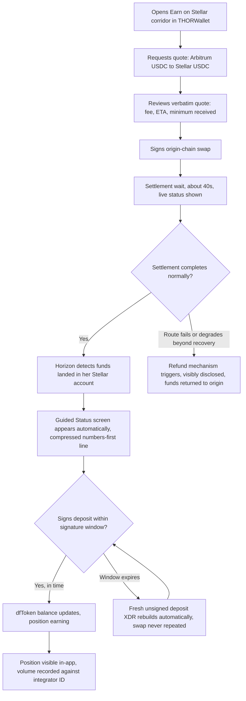
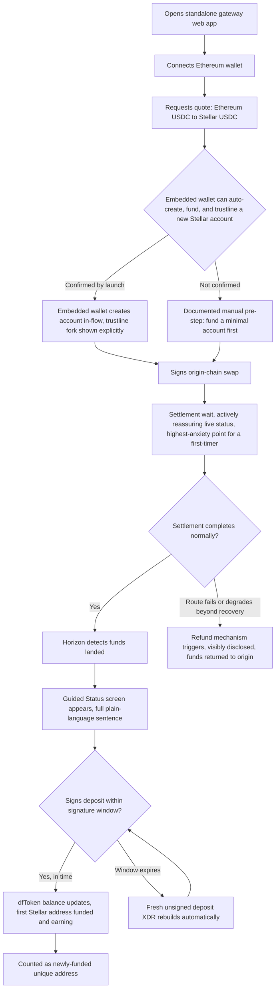
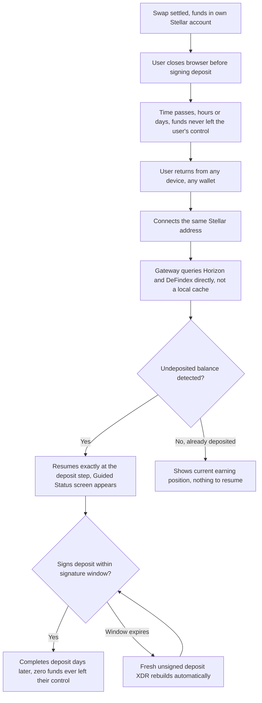

# UX Design Specification Zephyroute

**Author:** JafetCHVDev
**Date:** 2026-08-26

---

<!-- UX design content will be appended sequentially through collaborative workflow steps -->

## Executive Summary

### Project Vision

Zephyroute lets someone holding stablecoins or BTC on Ethereum, Arbitrum, or Bitcoin put that capital to work earning yield on Stellar — in two signatures, without learning Stellar's account model, without a bridge the product operates itself, and without the product ever touching their funds. It fuses two already-live, already-audited systems (NEAR Intents for cross-chain acquisition, DeFindex for yield) that nobody has chained together as a single flow before. The product's job is to be the thinnest possible layer between them.

### Target Users

**Primary persona — The Cross-Chain Yield Seeker:** a self-custody crypto user, moderately technical (already operates a wallet, has done a cross-chain swap before), holding idle USDC or BTC on Ethereum, Arbitrum, or Bitcoin. Knows Stellar has cheap, audited yield infrastructure but has no reason to learn its account/trustline model until the two-signature version exists.

Two sub-profiles need materially different UX depth within the same flow:
- **Returning Stellar user** (UJ-1) — already has a funded G-account and trustline; wants the fastest possible path from quote to earning.
- **Brand-new-to-Stellar user** (UJ-2) — needs trustlines, reserves, and the account model itself hidden entirely, onboarding through an embedded wallet (pending Open Question 1) or a documented manual fallback.

**Explicit non-users (v1):** people with no crypto on any chain yet (needs a fiat ramp, deferred); regulated/institutional capital needing compliance guarantees this flow doesn't provide; anyone wanting yield-strategy choice beyond DeFindex's existing vault menu.

`[ASSUMPTION — to confirm during Visual Foundation/Responsive steps]` Device and usage-pattern context wasn't fully pinned down with the user at this step. Working assumption, consistent with the product's dual distribution surface (FR-12/FR-13): design **responsive-first, not desktop-first** — the standalone app must work fully on mobile web, since the embeddable widget will very plausibly run inside a partner's mobile app (e.g. THORWallet). Usage pattern is assumed to be primarily a deliberate, one-off action per session ("move capital to yield now"), with a lighter secondary "check my position" pattern layered on top via FR-9's resumable state — not a habitual daily-check product.

### Key Design Challenges

- **Signature-window countdown UX** — the ~1–5 minute Soroban authorization window (FR-8) is a hard NFR, not a nice-to-have; expiry must never surface as an opaque error, only as a graceful, automatic rebuild.
- **Variable settlement wait** — 40s on Arbitrum vs. ~14 min on Bitcoin (§E, addendum); the user must stay informed without the product feeling stalled, especially on the BTC route.
- **Two onboarding depths, one flow** — hiding trustlines/reserves entirely for UJ-2 while never over-explaining to UJ-1.
- **One experience, two containers** — the same UX must hold up as a full standalone app and as a narrow, partner-branded embedded widget (THORWallet).
- **Cross-session, cross-device resumability** (UJ-3) — a user who settled funds but never deposited must be able to resume from any device, any wallet, at any later time, with zero funds ever having left their control in the meantime.

### Design Opportunities

- Surfacing the quote (fee, ETA, slippage) **verbatim, never editorialized** is already a functional requirement (FR-1) — this can double as a genuine trust differentiator against competitors that abstract these numbers away.
- Framing flow status as a narrative (quoted → submitted → settled → depositing → earning) turns a multi-minute technical wait into a guided journey instead of a black box — a direct differentiator against swap-only aggregators like WOWMAX that stop at the bridge step.
- The moment the dfToken balance updates is the product's real emotional payoff ("you're now earning yield on Stellar") — worth designing as its own confirming beat, not just another line of data on screen.

## Core User Experience

### Defining Experience

The single most important interaction isn't only the second signature (the deposit), though that one stays the most technically fragile because of the ~1-5 minute Soroban authorization window. The first signature (confirming the swap) is just as critical from a trust standpoint: it's the moment the user releases funds into a cross-chain flow that hasn't proven anything to them yet. If we nail one interaction, it's the full chain from "confirm swap" to "see funds arrive" to "deposit signed": each link needs its own level of confidence, not just the last one.

### Platform Strategy

Web, multi-container: standalone app plus an embedded widget inside partner apps (THORWallet, mobile and web). No native app (explicit non-goal, §6). No offline functionality needed, since every step depends on live chain state. Device capability to leverage: browser wallet-extension detection/connection on desktop (Freighter via Stellar Wallets Kit) and embedded-wallet flows on mobile, inside the partner's app.

### Effortless Interactions

- Reconnecting after closing the browser (UJ-3) should feel like nothing happened: same address, resumes exactly where it left off.
- The transition from "settlement detected" to "deposit ready to sign" happens automatically (Horizon polling): the unsigned XDR simply appears.
- For the returning user (UJ-1): quote, sign, sign should feel fast, with no extra exposition. The literal "two taps" framing is dropped here; the goal is to feel like two steps, not to literally be two steps.
- Trustline validation (FR-3) is the real fork point between the returning-user path (UJ-1) and the new-user path (UJ-2), and should be designed as a visible, explicit moment, not an invisible check that happens before the quote screen appears. A new user needs to see why they're being routed differently, not just end up on a different path.
- Eliminates the manual hunt for a yield destination that aggregators like WOWMAX leave the user to do.

### Critical Success Moments

- Confidence in the first signature. The moment a user confirms the swap needs its own clear success signal (not just a spinner): it's the first real vote of confidence they give the product.
- The settlement wait as its own moment, not only a technical challenge. For a first-time user (UJ-2), the 40 seconds to 14 minutes between confirming and seeing funds arrive is the highest-anxiety point in the whole flow, higher than the Soroban signing window, because it's the first time they're watching something cross-chain actually work. It needs active reassurance (live status, not a generic progress bar), handled separately from the "variable settlement wait" design challenge already listed above.
- "This is better": watching the deposit XDR appear automatically the instant funds land.
- Feels successful: the dfToken balance updates and is reflected as "earning."
- The interaction that would ruin it if it fails: the signature window expiring as a dead-end error instead of a graceful rebuild.
- First-time success: UJ-2 completes the whole loop without ever needing to understand what a trustline is.

### Experience Principles

1. Never let a technical constraint look like a product failure.
2. Show, don't abstract.
3. One flow, two depths, with the fork (trustline) designed explicitly, not hidden.
4. State lives on-chain, not in a session.
5. Container fidelity: inside a partner's widget (THORWallet), the experience should feel native to that app, not like an iframe bolted on top; the partner's brand and visual rhythm take priority over Zephyroute's own identity in that context.

### User Mental Model

**Anchor phrase:** the interaction users will describe to a friend is "I connected my wallet from Ethereum, signed twice, and I was already earning yield on Stellar." This reinforces the defining experience established above: the two-signature threshold is the product's core simplicity claim, not an implementation detail.

**Priya (returning Stellar user, UJ-1):**
- Existing mental model: a manual, multi-app process (bridge on one site, wait, switch tabs, deposit on another site).
- Expectation for Zephyroute: that same process collapsed into a single continuous flow, not something conceptually new.
- Confusion risk: if the flow ever asks her to leave the page or open a new tab, it breaks the exact expectation that brought her here.

**Marcus (new to Stellar, UJ-2):**
- No prior mental model of Stellar, bridging, or trustlines.
- Closest usable anchor: a savings account (deposit, watch it grow, withdraw), not an exchange (which implies trading and price risk that does not apply here).
- Confusion risk: the two required signatures do not fit a savings-account model and must be explained explicitly at the moment they happen, not left implicit.

### Success Criteria

- **Priya:** the end-to-end flow feels faster than doing it herself across two separate apps, her own personal benchmark.
- **Marcus:** zero moments where he has to leave the flow to look something up externally (no need to understand trustlines or reserves to finish).
- **Universal:** the fact that the entire journey required exactly two signatures is reinforced explicitly at completion ("2 signatures. Done."), as a concrete, countable proof point, not just an implied feeling.

### Novel UX Patterns

- The interaction shape (connect wallet, quote, sign, wait, sign, done) uses an established DeFi bridge-and-deposit pattern, validated against XOXNO's own bridge flow in the UX Pattern Analysis below. No new interaction paradigm is introduced.
- The genuine novelty is the backend combination this UI represents (NEAR Intents settlement triggering a DeFindex deposit automatically), not the interaction shape itself. This matches the "Show, don't abstract" experience principle above: the interface should feel reassuringly ordinary while the value delivered underneath is what's new.
- Familiarity is treated as a trust asset here, not a compromise, since trust is established below as the primary emotional goal for this product.

### Experience Mechanics

**1. Initiation:** triggered automatically the instant Horizon confirms funds have landed in the user's account. No manual "check status" action required.

**2. Interaction:** a single primary "Sign" action with the deposit XDR already fully formed (default vault, slippage-protected minimum amount already applied), its destination, exact amount, and minimum guaranteed balance rendered visibly on screen before signing, so review happens where the user can see it, not only inside the XDR. The user is not asked to choose a vault or adjust the amount at this exact moment; any such choice happens earlier, at quote time, so this moment stays as fast as possible. Two exceptions are handled explicitly rather than silently: an expired signature window triggers an automatic re-quote instead of submitting a stale transaction, and a wallet disconnection mid-signature shows a clear reconnect state instead of assuming the signature went through.

**3. Feedback:** the visible countdown carries over from the settlement wait, plus the wallet's native signing confirmation. After signing, the flow moves through two distinct, visibly labeled states, never collapsed into one: "submitted" (broadcast accepted, transaction hash available) and "confirming on-chain" (awaiting ledger finality). A transaction reference (hash, linked to a Horizon explorer view) is shown starting at "submitted," giving the user independently verifiable proof rather than asking them to trust the interface. If the user reloads the page or returns later while a transaction is pending, the flow reconstructs the correct state by re-querying Horizon and the DeFindex vault directly, rather than relying on in-memory state that would be lost on reload.

**4. Completion:** completion is not the signature itself, it is the dfToken balance actually updating to reflect "earning," as already established in Critical Success Moments above. The "confirming on-chain" state defined above covers the honest gap between signing and completion, so it is never treated as instantaneous. If the deposit reverts on-chain (for example, slippage exceeded), this is surfaced explicitly with a clear next step, never left as a silent dead end.

State names above (submitted, confirming on-chain, completed, failed) are precise internal labels for this specification. User-facing copy always translates them into plain language for a first-time user (for example, "sent," "almost there," "done"), consistent with the novice-proof trust pattern from Desired Emotional Response below; the technical label and transaction hash stay one tap away for anyone who wants to verify directly. The "confirming on-chain" wait is normally a few seconds, matching Stellar's ledger close time; if it runs longer than that, the same proactive delay-disclosure pattern already defined for the settlement wait applies here too, surfacing "this is taking longer than usual" rather than leaving the state silent.

## Desired Emotional Response

### Primary Emotional Goals

Trust and Control, held jointly and continuously, not as isolated peak moments but as a state sustained from the first quote to the final confirmed position. Trust is the dominant goal: every interaction must reinforce that the user's funds were never actually at risk. Control, here, means control over understanding, not control over outcome, since the user has zero ability to accelerate or intervene during the two unavoidable waits (settlement, signature window). What actually replaces anxiety in those waits is visibility: knowing exactly where you are in the process, even without the power to move it faster.

### Emotional Journey Mapping

- First quote: informed confidence, built on seeing real numbers (fee, ETA, refund terms) verbatim, not a marketing-smoothed estimate.
- First signature (swap confirm): trust anchored by a visible safety net (the refund mechanism surfaced before signing), not blind faith in the product's word.
- Settlement wait (40s-14min): visibility replacing anxiety, an active, honest progress state tied to real on-chain status, never a passive spinner standing in for "trust us, it's working."
- Deposit signature window: urgency without panic, a visible countdown paired with the explicit knowledge that a missed window rebuilds gracefully rather than losing anything.
- Completion (dfToken earning): calm assurance rather than a showy payoff, reinforcing that trust is an ongoing state, not a one-time reward for finishing.
- Failure states (route down, window expired): trust preserved through transparency, the system visibly disclosing what happened and what happens next, never going silent or opaque.
- Return visits (UJ-1, UJ-3): continuity of trust, reconnecting instantly confirms "nothing was ever at risk while you were away."

### Micro-Emotions

- Primary pair: Trust vs. Skepticism, the dominant emotional axis for the entire product.
- Secondary pair: Control (over understanding) vs. feeling "in the dark," most acute during the two cross-chain/cross-layer waits.
- Deliberately de-prioritized as a general tone: high-arousal delight or excitement. This is financial infrastructure moving real capital, not a consumer entertainment product; confidence outranks dazzle everywhere except the one deliberate delight moment defined below.

### Design Implications

- Trust to UX approach: surface real data verbatim at every step (fee, ETA, refund terms, transaction status), never abstracted, rounded, or editorialized.
- Control to UX approach: replace every wait with a visible, honest progress state tied to real on-chain status (Horizon polling), never a generic spinner.
- Novice-proof trust: verbatim technical data (fee, ETA, slippageTolerance, refund terms) stays always available per FR-1, but the primary surface leads with plain-language translation for a first-time user like Marcus; the raw data is one tap away, never the only presentation.
- Evidence-backed reassurance, not evidence instead of reassurance: for a first-time user like Marcus, raw evidence (an XDR, a refund field, a correlation hash) isn't legible on its own, showing it alone doesn't actually reassure, it's just more unfamiliar text. Plain-language copy that interprets the evidence ("your funds go straight to your own wallet, we never hold them") does more real trust-building for a novice than the evidence by itself; the raw data still sits one tap away for anyone who wants to verify it directly.
- Fast path preserved for returning users: the plain-language and expectation-setting scaffolding designed for a first-time user must never cost a returning user like Priya extra taps or slow the "quote, sign, sign" fast path already defined in Core User Experience; expectation cues stay as a persistent, glanceable element, never a blocking step a repeat user has to dismiss.
- One deliberate delight moment, not a general tone: the automatic appearance of the deposit XDR the instant funds land (already flagged in Core User Experience as the "this is better" competitive differentiator) is allowed to feel like a small delight, precisely because it's earned and specific. Everywhere else, calm and evidence-based reassurance stays the default, so that one moment keeps its impact instead of blending into a uniformly "exciting" product.
- Set expectations before commit, not just reassure during the wait: the quote screen must show the specific expected duration range for the exact route chosen (e.g., ~40s for Arbitrum vs. ~14 min for Bitcoin) before the user signs, not a generic "cross-chain settlement in progress" framing borrowed from the faster routes. Trust breaks when reality violates an expectation the product itself never set.
- Avoid any interaction that asks the user to "just trust us" without visible, checkable evidence.
- Avoid silent failures or dead-end errors, always show what is happening and what happens next.

### Emotional Design Principles

1. Trust is continuous, not a peak moment, it must hold from the first quote to the last balance check, not spike once and fade.
2. Control replaces anxiety during every wait through visibility, no wait is silent, every wait shows real, verifiable progress, even when the user cannot change the outcome.
3. Evidence-backed reassurance, not empty reassurance. Trust is earned by pairing plain-language interpretation with the real evidence behind it, never bare technical data dropped on an unprepared user, and never comforting copy with nothing real behind it.
4. Calm over celebration, success moments confirm competence and safety, not hype, with one deliberate exception at the automatic deposit-XDR moment.
5. Failure preserves trust, a degraded route or expired window is disclosed immediately and handled gracefully, never hidden or dead-ended.
6. Visibility depends on monitoring, not just UI. The calm, evidence-based progress state this section promises is only true if the system actively detects upstream degradation in real time (per the "Upstream availability transparency" NFR). This is a prerequisite of the trust goals in this section, not a nice-to-have, and it is directly gated on resolving PRD Open Question 10 (threat model / monitoring plan) before launch.

## UX Pattern Analysis & Inspiration

### Inspiring Products Analysis

#### XOXNO (xoxno.com, Stellar lending protocol)

- Core problem solved elegantly: makes a genuinely complex, technical DeFi mechanism (money market lending on Soroban) feel legible on first load, no crypto-native fluency required. The homepage answers "what is this," "is it safe," and "what's the real state of the protocol" within the first screen.
- Trust-building without jargon: leads immediately with a pill badge, "Non-custodial lending protocol," before any other copy, then backs every trust claim with a one-sentence mechanism, not just an adjective (not just "Audited," but "Every contract that touches funds goes through independent security review").
- Real-time, precise data as its own trust device: exact decimal balances ("10,000.00000000 USDC"), live aggregate stats ($1.59M supplied, 908 lenders), and a pulsing "LIVE" badge on the markets table, nothing paraphrased, nothing rounded for presentation.
- Visualizing custody, not just claiming it: a "How capital moves" section renders the fund flow as a 3-node diagram (You, the pool, borrowers, with "interest flows back to you"), turning an abstract non-custodial claim into something the eye can verify at a glance.
- Progressive disclosure for onboarding: a bottom FAQ accordion ("Stellar lending, explained") answers baseline questions without forcing that explanation onto users who already know the answer.
- Visual system: near-black background, a single high-contrast neon green accent, oversized condensed display type for headlines, with an italic treatment reserved specifically for the words carrying the trust or differentiation claim (e.g. "on Stellar.", "Audited."), a recurring visual signal for "this is the claim that matters."

### Transferable UX Patterns

**Trust Patterns:**
- Mechanism-backed trust badges: pair every trust claim (non-custodial, audited) with a one-sentence explanation of the real mechanism behind it, directly extending the "evidence-backed reassurance" principle already committed to in Desired Emotional Response.
- A literal fund-flow diagram: Zephyroute's own flow (user, solver, user's Stellar account, DeFindex vault) is a strong candidate for the same node-based visual treatment, since the non-custodial invariant is the single most important claim to make legible fast for a first-timer like Marcus.

**Data Presentation Patterns:**
- Verbatim precision as a trust signal: XOXNO showing unrounded, exact live figures validates, not just inspires, Zephyroute's own FR-1 requirement to show quote data verbatim, never paraphrased.
- A persistent "LIVE" indicator on real-time data: worth adopting for Zephyroute's settlement-status view (quoted, submitted, settled, depositing, earning), reinforcing that what the user sees is live, not cached.

**Onboarding Patterns:**
- FAQ accordion for the curious, invisible to the confident: fits directly into the "novice-proof trust" design implication already written for Marcus, without slowing Priya's fast path.

**Visual Patterns:**
- One consistent accent color and one accent typographic treatment reserved only for the words that carry the trust or differentiation claim, so the accent stays meaningful instead of decorative.

**Wait-State Patterns (genre mashup: XOXNO trust language + cross-border transfer tracking):**
- A visible, bounded step tracker for the whole flow (quoted, submitted, settled, depositing, earning), each step timestamped the instant it completes, mirroring how cross-border transfer products build a visible audit trail rather than a single ambiguous "processing" state. This pairs XOXNO's verbatim, verifiable trust language with a genre built specifically to keep users calm through waits XOXNO itself never has to solve.
- Proactive delay disclosure: if real elapsed time approaches or exceeds the route-specific ETA already set at quote time, the system surfaces "this is taking a little longer than usual" automatically, before the user has to wonder or refresh, borrowed directly from how transfer-tracking products handle a slow transfer instead of leaving silence.

### Anti-Patterns to Avoid

- XOXNO's homepage doesn't demonstrate any real waiting or loading state, its supply and withdraw actions are near-instant, single-chain Soroban calls. This is a genuine gap, not something to borrow: Zephyroute's hardest UX problem (the 40s-14min cross-chain settlement wait, the ~1-5min signature window) has no direct precedent on XOXNO's own site. Import their trust and data patterns, but design the settlement-wait UX fresh from Zephyroute's own Desired Emotional Response section, informed here by the cross-border transfer-tracking genre.
- Over-dense stat walls: XOXNO's markets table (6 assets, 3 columns, all visible on load) fits a lending market with many assets, but Zephyroute's flow is much narrower (2-3 origin assets, 1-2 destination vaults). Copying a dense table verbatim would overstate complexity that doesn't exist in Zephyroute's actual scope.

### Design Inspiration Strategy

**What to Adopt:**
- Mechanism-backed trust badges, directly extending the Desired Emotional Response section's "evidence-backed reassurance" principle.
- A literal fund-flow diagram visualizing custody, making Zephyroute's non-custodial invariant legible at a glance for a first-timer.
- Verbatim, unrounded live data, already required by FR-1, confirmed here as good UX, not just correct engineering.
- An FAQ accordion for onboarding depth, serving Marcus without slowing Priya, consistent with "one flow, two depths."
- A timestamped step tracker for the settlement and deposit flow, filling the exact wait-state gap XOXNO's own site doesn't need to solve, borrowed from the cross-border transfer-tracking genre rather than invented from scratch.

**What to Adapt:**
- The visual system (dark background, single neon accent, condensed display type, italic accent for trust words): adopt the underlying idea, one consistent, meaningful accent reserved for what matters, rather than copying XOXNO's specific palette; Zephyroute's actual color and typography choices come later in the Visual Foundation step.
- The "LIVE" badge pattern: adapt to Zephyroute's actual live states (quoted, submitted, settled, depositing, earning), which are richer and slower than XOXNO's near-instant lending actions.

**What to Avoid:**
- Copying XOXNO's dense multi-asset markets table wholesale, Zephyroute's real scope doesn't need that density.
- Assuming XOXNO solved the waiting-state problem, it didn't need to; Zephyroute's settlement wait and signature window remain problems to design fresh.

This strategy will guide our design decisions while keeping Zephyroute unique.

## Design System Foundation

### 1.1 Design System Choice

Custom Design System. Zephyroute builds its own component library and visual language from scratch, not layered on top of an existing established or themeable off-the-shelf system.

### Rationale for Selection

- Explicit choice to prioritize full visual ownership of Zephyroute's identity as a standalone product, over the speed advantage of a themeable system.
- Full control is genuinely warranted given the bar set in the UX Pattern Analysis (mechanism-backed trust badges, precise verbatim data displays, a literal custody-flow diagram, a timestamped step tracker, an italic-accent typographic device), these are bespoke component needs a generic system wouldn't ship out of the box regardless.
- Trade-off accepted knowingly: higher initial build investment, and no "free" accessibility or interaction-behavior layer from an existing primitives library. This must be built or consciously sourced underneath the custom visual layer, not skipped, since Zephyroute's own NFRs (signature-window countdown, non-custodial trust communication) depend on correct, accessible interactive behavior, not just custom visuals.

### Implementation Approach

- Build the custom visual system on top of unstyled, accessible behavioral primitives (e.g. Radix UI or an equivalent headless primitives layer), so "custom" applies to the visual and branding layer, not to reinventing keyboard navigation, focus management, or ARIA semantics for every interactive component from zero.
- Token-first construction: define Zephyroute's own design tokens (color, type scale, spacing, motion) before building components, so the standalone app and the embedded widget draw from one source of truth instead of diverging over time.
- Priority build order follows the highest-stakes moments already identified rather than generic chrome first: the trust-badge component, the custody fund-flow diagram, the timestamped step tracker for the settlement and deposit wait, and the Soroban signature-window countdown, before nav, footer, and other lower-stakes UI.
- Explicit scope boundary, not open-ended custom: only the components that carry Zephyroute's actual differentiation are genuinely bespoke from scratch (the trust-badge component, the custody fund-flow diagram, the timestamped step tracker, the Soroban signature-window countdown). Everything else (buttons, inputs, modals, nav, forms) is a thin visual skin over the accessible headless primitives from day one, not something to "custom-build eventually." Given the aggressive weeks-scale MVP timeline and small team, this boundary is what makes "custom design system" and the actual launch date compatible.

### Customization Strategy

- Container Fidelity (Core User Experience, Experience Principle #5) still applies inside a fully custom system: the token layer must let the embedded widget swap Zephyroute's own token values for a partner-appropriate theme (e.g. via scoped CSS custom properties at the widget's root) without forking components, so "custom design system" stays compatible with "feels native inside THORWallet."
- The visual language explored in Visual Foundation (next major phase) inherits the trust-forward, dark, single-accent direction validated against XOXNO in UX Pattern Analysis, with Zephyroute's own specific palette and typography decided fresh there, not copied.
- Token discipline as a hard gate, not a convention: no component ships with a hardcoded, non-token visual value (a raw color, a fixed border-radius, an off-token spacing value), enforced by lint rule or review checklist. This exists specifically because the Container Fidelity promise breaks silently the first time a value is hardcoded under time pressure, and by the time it surfaces (in a THORWallet demo, late), it's expensive to retrofit across every component already built.

## Visual Design Foundation

### Color System

Signal Cyan confirmed as the single accent. Base palette: background `#0E1116`, surface `#171B22`, border `#262C35`, primary text `#EDEFF2`, muted text `#9AA3AE`, accent `#3FD6D0` with `#04211F` as the ink color for text placed on top of the accent (buttons, active badges).

Semantic states stay separate from the accent, since decorative color and status color are not the same thing: warning uses a muted amber (`#E8A33D`), critical/error uses a muted red (`#E5484D`) for borders, icons, and large elements. Error and warning **text** specifically uses a lighter red (`#FF7A80`), since the base error red only clears WCAG AA contrast by a narrow margin, an unacceptable risk for exactly the messages the No silent failure criterion depends on. The "earning" success state deliberately reuses the accent itself rather than introducing a green, consistent with Calm over celebration, since a special success color would read as a game-like reward the emotional design principles already ruled out.

### Typography System

Three typefaces, each with one job, each with an explicit fallback stack so a blocked or slow font load degrades gracefully instead of looking broken:
- **Fraunces** (display/headings), falling back to `Georgia, serif`: carries the "professional but approachable" balance the user asked for, a serif with warmth rather than a cold corporate sans.
- **Public Sans** (body and UI text), falling back to `system-ui, -apple-system, "Segoe UI", sans-serif`: clean and efficient for microcopy, labels, and interface chrome, matching the "efficient" layout direction.
- **IBM Plex Mono** (all numeric and verbatim data), falling back to `ui-monospace, "SFMono-Regular", monospace`: fees, amounts, countdowns, and transaction hashes always render in tabular monospace, reinforcing that this specific text is exact data, not editorialized copy.

Base body size 15px/16px with a compact type scale, favoring density over generous whitespace, consistent with the efficient direction.

### Spacing & Layout Foundation

8px base spacing unit. Single narrow content column (roughly 480 to 560px max width) at all times, never a wide multi-column or dashboard layout, since the core flow (quote, sign, sign) is inherently linear. This single decision serves two needs at once: it keeps the standalone app dense and efficient, and it is already compatible with THORWallet's narrow embedded widget width without a separate responsive redesign.

Density is not uniform: quote rows and step-tracker items stay compact and tight, but the Sign action, its countdown, and any warning or error state get extra spacing around them, since these are the highest-stakes moments in the flow and should never be visually crowded or easy to mis-tap.

### Accessibility Considerations

- WCAG AA contrast targets (4.5:1 for body text, 3:1 for large text and UI components) apply to every color pairing in this system, verified by relative-luminance calculation against the dark palette: Signal Cyan, muted text, and the accent-ink button text all clear these targets with comfortable margin. The base error red clears AA only narrowly, which is why error and warning text use the lighter `#FF7A80` variant instead.
- State never relies on color alone: step-tracker progress, warnings, and errors always pair their color with a label or icon change, since color-only signaling fails for colorblind users and conflicts with the No silent failure acceptance criterion. This is not optional polish for the red/amber pair specifically, since protanopia and deuteranopia can render both as a similar brownish tone.
- Any animated indicator (the step tracker's active-step pulse, the signature countdown) respects `prefers-reduced-motion`, falling back to a static state with no loss of information.
- Countdown and other critical text stay legible at the smaller width the THORWallet embed imposes, not only at the standalone app's own viewport.

## Design Direction Decision

### Design Directions Explored

Six structural variations were explored against the same locked visual foundation (Signal Cyan, Fraunces, Public Sans, IBM Plex Mono, dark palette) and the same real content (trust badge, verbatim quote, settlement step tracker, deposit-signing action): Linear Card Stack (dense, undivided), Segmented Steps (bordered per-phase panels), Status-First (persistent progress rail), Data-Forward (hero number, built for Priya), Narrative (plain-language sentences, built for Marcus), and Minimal Chrome (no borders, typography-only separation). A background-treatment comparison (flat, soft glow, two-tone mesh, vivid) was also explored and resolved in favor of keeping the flat, calm background already established in Visual Design Foundation, rather than introducing a more colorful or attention-seeking treatment.

### Chosen Direction

Direction G, Guided Status, a synthesis rather than any single direction taken as-is: Status-First's persistent progress rail for continuous visibility, a compressed plain-language line that already carries the verbatim send, receive, and ETA figures (rather than Narrative's full paragraph), a secondary fee row, and a "See full quote" progressive disclosure for anyone who wants the complete verbatim breakdown. The background stays the flat, calm dark surface, not the more vivid treatment considered and set aside.

The plain-language line itself has two depths, not one: a full sentence for a first-time user (UJ-2), and a condensed, numbers-first version for a returning user (UJ-1) who already knows the shape of this screen. This reuses the same trustline-fork signal that already distinguishes these two paths elsewhere in the flow, so it adds no new detection logic, only a second copy variant for content already being fetched.

### Design Rationale

- The persistent status rail directly serves two already-committed emotional design principles: Trust is continuous, not a peak moment, and Control replaces anxiety during every wait through visibility.
- Leading with a plain-language sentence, rather than terse label rows, satisfies the Desired Emotional Response commitment that "the primary surface leads with plain-language translation for a first-time user like Marcus," while embedding the real numbers directly in that sentence keeps it from ever hiding or paraphrasing verbatim data (FR-1).
- The sentence is compressed to one line, not Narrative's full paragraph, because Fast path preserved for returning users explicitly rules out slowing Priya's quote-sign-sign flow with scaffolding built for a first-time user. Even at one line, a User Persona Focus Group surfaced that Priya would rather see only the numbers, which is why the line itself now has two depths (full sentence for UJ-2, numbers-first for UJ-1), extending the "One flow, two depths" experience principle to this specific piece of copy rather than treating it as one-size-fits-all.
- This two-depth line adds no new technical scope: it reuses the trustline-fork detection already established as a first-class moment in Core User Experience, confirmed feasible by an Expert Panel Review against the project's aggressive weeks-scale timeline.
- The step-tracker rail's labels (Quoted, Settled, Earning) are intentionally not explained further for a first-time user, since a focus group reaction confirmed the rail functions as a glanceable progress cue, not literal text meant to be read and understood label by label.
- The "See full quote" disclosure reuses the FAQ-accordion pattern already adopted in UX Pattern Analysis (serves the curious, invisible to the confident) rather than inventing a new interaction.
- The flat background was kept, rather than the more colorful treatment considered, because a more attention-seeking surface would compete with Calm over celebration and with the "one consistent accent, reserved for what matters" rule already established for this design system.

### Implementation Approach

The status rail, quote data, step tracker, and sign action all fall inside the bespoke component scope already prioritized in Design System Foundation (trust-badge component, timestamped step tracker, signature-window countdown). The compressed plain-language line and the "See full quote" disclosure are new, small additions to that same scope, not a new category of component. The background stays a single solid token (no gradient token added to the system), keeping the token model from Design System Foundation unchanged.

## User Journey Flows

### UJ-1: Priya swaps from inside THORWallet

### UJ-2: Marcus onboards from Ethereum via the standalone app

### UJ-3: A user returns days later to finish an unsigned deposit

### Journey Patterns

- Convergent navigation: the three journeys enter differently but all converge on the exact same Guided Status screen the instant settlement is detected, regardless of entry point.
- A single decision pattern: the only genuine branch points are the onboarding fork (UJ-2 only) and the signature-window expiry-and-rebuild.
- State reconstructed, never cached: UJ-3 depends directly on Independent auditability since resuming requires querying Horizon and DeFindex live.
- Two uniform failure patterns, not one: signature-window expiry always rebuilds automatically, and swap/settlement failure always triggers the visible refund mechanism already committed to in Desired Emotional Response. UJ-3 correctly excludes the second pattern, since its scope only begins after settlement has already succeeded.

### Flow Optimization Principles

- Minimizing steps to value happens by convergence onto the same Guided Status screen across all three journeys.
- Cognitive load is only genuinely added at the UJ-2 onboarding fork, and it stays visible and explicit there.
- Error recovery is uniform: the signature window expiring is never treated as a different kind of failure depending on journey.
- The one deliberate delight moment stays singular across all three journeys.
- No failure in any journey resolves silently: a signature-window miss rebuilds, and a settlement failure refunds, both disclosed visibly, never a dead end the user has to guess their way out of.

## Component Strategy

### Design System Components

Foundation components (Button, Dialog, Accordion/Disclosure, Toast, Tooltip) come from the headless behavioral primitives layer already chosen in Design System Foundation, styled with a thin visual skin using the tokens from Visual Design Foundation. These cover every generic interaction surface (the Sign button itself, the "See full quote" disclosure panel, any inline alert) without needing bespoke design work.

### Custom Components

**Trust Badge**
- Purpose: communicate the non-custodial invariant at a glance, the single most important claim in the product, per the mechanism-backed trust pattern adopted from XOXNO.
- Usage: appears at the top of every screen in the core flow, always visible, never dismissible.
- Anatomy: a small accent-colored dot paired with one mechanism-backed sentence (for example, "Non-custodial. Funds go straight to your wallet.").
- States: default only. It never changes appearance during a failure, since dramatizing this specific element would contradict Calm over celebration; failures are surfaced elsewhere.
- Variants: none.
- Accessibility: meaning never depends on the dot's color alone, the sentence always carries it; contrast already verified in Visual Design Foundation.
- Content Guidelines: one sentence, mechanism-backed, no jargon.
- Interaction Behavior: static, non-interactive, no tooltip, since deeper evidence already has its own path through "See full quote."

**Custody Fund-Flow Diagram**
- Purpose: visualize the non-custodial claim (user, solver, user's Stellar account, DeFindex vault) as a diagram, not just a sentence, per XOXNO's "visualizing custody, not just claiming it" pattern.
- Usage: lives behind progressive disclosure (inside "See full quote" or a "How this works" panel), not on the primary Guided Status screen, since that screen stays dense and efficient by design.
- Anatomy: a 3 to 4 node diagram with directional arrows.
- States: static, purely explanatory; it does not duplicate the step tracker's job of showing live progress.
- Variants: none.
- Accessibility: ships with an accessible text-equivalent description alongside the visual diagram. The same text-equivalent description doubles as the rendering fallback if the diagram itself fails to load inside a constrained embed context, so a rendering failure degrades to readable text rather than a blank gap.
- Content Guidelines: labels reuse the exact terms already established (You, Solver, Your Stellar Account, DeFindex Vault).
- Interaction Behavior: static, viewed on demand only.

**Timestamped Step Tracker**
- Purpose: continuous visibility into flow progress, the mechanism behind Trust is continuous and Control replaces anxiety.
- Usage: renders as the persistent rail chosen in the Design Direction Decision (Guided Status), reused identically across all three user journeys.
- Anatomy: a horizontal segmented rail with short labels (Quoted, Settled, Earning), each step's completion timestamp sourced directly from the originating record (Horizon ledger close time, 1Click submission record, DeFindex vault state), never from the client's local clock, consistent with Independent auditability.
- States: upcoming (dim), active (accent color, a pulsing indicator that respects prefers-reduced-motion), done (filled, timestamp on hover or tap), and failed (a distinct visual state for an expired signature window, a triggered refund, or an on-chain revert, using the accessible error-text color from Visual Design Foundation, never color alone).
- Variants: none, the same component serves all three journeys per the Convergent navigation pattern from User Journey Flows.
- Accessibility: the active step uses aria-current; every state pairs its color with a label or icon change.
- Content Guidelines: step labels stay short and are intentionally not individually explained to a first-time user, confirmed sufficient by the User Persona Focus Group in the Design Direction Decision.
- Interaction Behavior: automatic progression; tapping a completed step reveals its timestamp without cluttering the default view.

**Signature-Window Countdown**
- Purpose: the visible, honest urgency-without-panic mechanism from the Emotional Journey Mapping.
- Usage: appears only during the deposit-signing moment, directly paired with the Sign action.
- Anatomy: a tabular-mono countdown chip (mm:ss).
- States: normal countdown, expiring soon, and expired-and-rebuilding, which transitions directly into the graceful automatic rebuild already defined in Core Experience Mechanics rather than any error state.
- Variants: none.
- Accessibility: the rebuild transition announces itself through an aria-live polite region, so a screen reader user is not left confused when the countdown suddenly resets; any pulsing in the expiring-soon state respects prefers-reduced-motion.
- Content Guidelines: numeric only, exact time remaining, never editorialized.
- Interaction Behavior: fully automatic, the user only observes it. The countdown derives its remaining time from the server-issued authorization window expiry, not from the client's local clock, and resyncs against that source periodically, so a device with a skewed clock never shows an incorrect amount of time remaining.

### Component Implementation Strategy

Only these four components are genuinely custom-built from scratch, matching the explicit scope boundary already committed to in Design System Foundation. The new interaction surfaces that emerged later, in the Design Direction Decision (the two-depth plain-language line, the "See full quote" disclosure) and in User Journey Flows (the refund-mechanism disclosure), are deliberately built as compositions of these four components plus the foundation layer, not treated as new bespoke components in their own right. This keeps the "custom design system compatible with an aggressive launch date" boundary intact instead of letting scope quietly grow every time a later step surfaces a new UI need.

### Implementation Roadmap

**Phase 1, Core Components:** Timestamped Step Tracker (rail variant), Signature-Window Countdown, and Trust Badge, since all three appear on the happy path of every one of the three user journeys and block a first end-to-end demo.

**Phase 2, Supporting Components:** the failed state of the Step Tracker (expired window, refund, revert) and the refund-mechanism disclosure composition, required before launch under the No silent failure acceptance criterion but not needed for an initial happy-path demo.

**Phase 3, Enhancement Components:** the Custody Fund-Flow Diagram and the polish pass on the returning-versus-new-user two-depth line, both refinements of an already-working flow rather than blocking dependencies.
